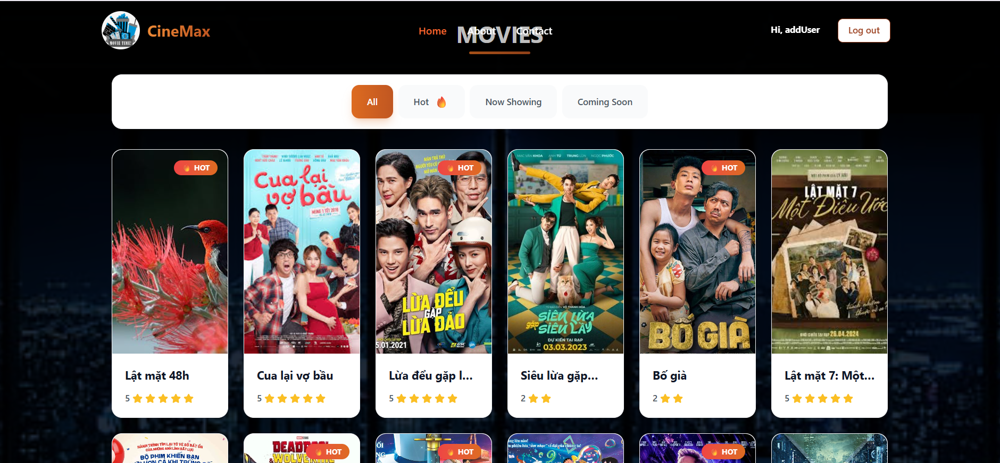
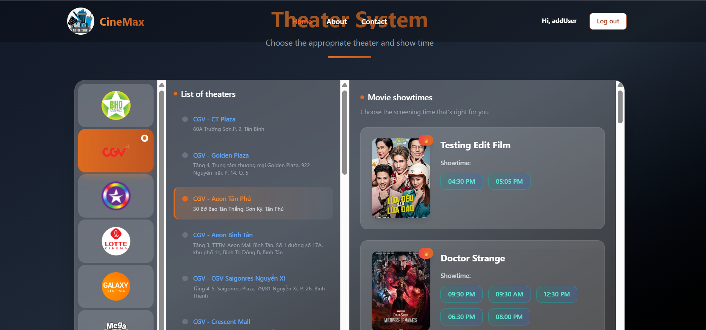
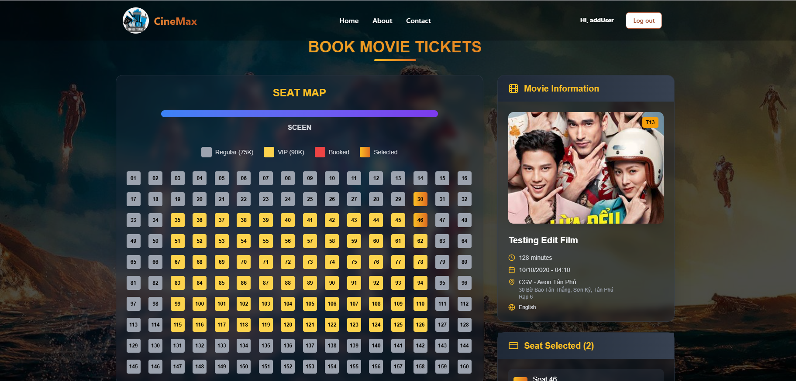
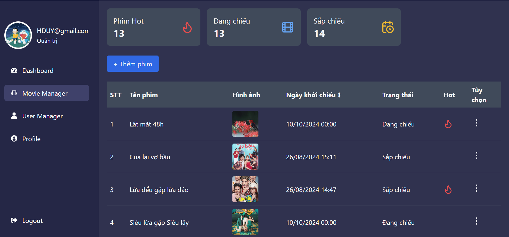

# 🎬 Movie Booking System

> Hệ thống đặt vé xem phim trực tuyến hiện đại được xây dựng với React.js và các công nghệ frontend tiên tiến



## ✨ Tổng Quan

**Movie Booking System** là một ứng dụng web đặt vé xem phim trực tuyến với giao diện người dùng hiện đại và trải nghiệm mượt mà. Hệ thống cho phép người dùng duyệt phim, chọn suất chiếu, đặt vé và quản lý booking một cách dễ dàng.

### 🌟 Tính Năng Chính

- **🎭 Duyệt Phim**: Xem danh sách phim đang chiếu và sắp chiếu
- **🎪 Chi Tiết Phim**: Thông tin chi tiết, trailer, đánh giá
- **🎫 Đặt Vé Trực Tuyến**: Chọn rạp, suất chiếu và chỗ ngồi
- **👤 Quản Lý Tài Khoản**: Đăng ký, đăng nhập, quản lý thông tin, quản lý user
- **📱 Responsive Design**: Tối ưu cho mọi thiết bị

## 🚀 Tech Stack

### Core Technologies
- **⚛️ React** - Thư viện UI hiện đại
- **⚡ Vite** - Build tool nhanh chóng
- **📱 React Router DOM** - Điều hướng SPA

### State Management & Data Fetching
- **🗃️ Redux Toolkit** - Quản lý state toàn cục
- **🔄 React Query** - Server state management & caching

### Form Handling & Validation
- **📋 React Hook Form** - Quản lý form hiệu quả
- **✅ Zod** - Schema validation mạnh mẽ

### Styling & UI
- **🎨 CSS Modules / Styled Components** - Styling component
- **📐 Responsive Design** - Mobile-first approach

## 📁 Cấu Trúc Dự Án

```
Directory structure:
└── nmhieu32-project_movie/
    ├── README.md
    ├── eslint.config.js
    ├── index.html
    ├── package.json
    ├── Task.xlsx
    ├── vite.config.js
    ├── public/
    │   └── images/
    └── src/
        ├── App.css
        ├── App.jsx
        ├── index.css
        ├── main.jsx
        ├── assets/
        ├── pages/
        │   ├── AdminTemplate/
        │   │   ├── index.jsx
        │   │   ├── _components/
        │   │   │   ├── avt.jsx
        │   │   │   └── navigation.jsx
        │   │   ├── Dashboard/
        │   │   │   ├── cinemaStats.jsx
        │   │   │   ├── filmChart.jsx
        │   │   │   ├── index.jsx
        │   │   │   ├── statsCard.jsx
        │   │   │   └── userStats.jsx
        │   │   ├── MovieManager/
        │   │   │   ├── addMovieForm.jsx
        │   │   │   ├── editMovieModal.jsx
        │   │   │   ├── index.jsx
        │   │   │   ├── movieChart.jsx
        │   │   │   ├── movieList.jsx
        │   │   │   ├── movieRow.jsx
        │   │   │   ├── movieStats.jsx
        │   │   │   └── statCard.jsx
        │   │   ├── UserManager/
        │   │   │   ├── index.jsx
        │   │   │   └── sliderDelete.jsx
        │   │   └── UserProfile/
        │   │       └── index.jsx
        │   └── HomeTemplate/
        │       ├── index.jsx
        │       ├── _components/
        │       │   ├── Footer/
        │       │   │   └── index.jsx
        │       │   ├── Header/
        │       │   │   └── index.jsx
        │       │   └── Skeleton/
        │       │       ├── booking.skeleton.jsx
        │       │       ├── card.theater.jsx
        │       │       ├── carousel.theater.jsx
        │       │       ├── footer.skeleton.jsx
        │       │       ├── movieDetail.skeleton.jsx
        │       │       ├── profile.skeleton.jsx
        │       │       └── theater.skeleton.jsx
        │       ├── AboutPage/
        │       │   └── index.jsx
        │       ├── BoxDetailsPage/
        │       │   ├── Chair.jsx
        │       │   ├── index.jsx
        │       │   └── listChairSelected.jsx
        │       ├── ContactPage/
        │       │   └── index.jsx
        │       ├── HomePage/
        │       │   ├── index.jsx
        │       │   ├── Carousel/
        │       │   │   └── index.jsx
        │       │   ├── ListMovie/
        │       │   │   ├── index.jsx
        │       │   │   └── Movie.jsx
        │       │   └── TheaterSystem/
        │       │       └── index.jsx
        │       ├── LoginPage/
        │       │   └── index.jsx
        │       ├── MovieDetailsPage/
        │       │   └── index.jsx
        │       ├── NotFoundPage/
        │       │   └── index.jsx
        │       ├── ProfilePage/
        │       │   ├── BookingHistory.jsx
        │       │   ├── index.jsx
        │       │   ├── Modal.jsx
        │       │   └── Profile.jsx
        │       └── RegisterPage/
        │           └── index.jsx
        ├── routes/
        │   └── index.jsx
        ├── services/
        │   ├── api.js
        │   ├── auth.api.js
        │   ├── cenima.api.js
        │   ├── movie.api.js
        │   ├── ticket.api.js
        │   └── user.api.js
        └── store/
            ├── auth.slice.js
            ├── booking.slice.js
            ├── index.js
            ├── theater.slice.js
            └── user.slice.js

```

## 🛠️ Cài Đặt & Chạy Dự Án


### Các Bước Cài Đặt

1. **Clone repository**
   ```bash
   git clone https://github.com/username/movie-booking-system.git
   cd movie-booking-system
   ```

2. **Cài đặt dependencies**
   ```bash
   npm install
   # hoặc
   yarn install
   ```

3. **Chạy ứng dụng**
   ```bash
   npm run dev
   # hoặc
   yarn dev
   ```

5. **Truy cập ứng dụng**
   
   Mở trình duyệt và truy cập: `http://localhost:5173`

## 📱 Screenshots

### Trang Chủ


### Chi Tiết Phim


### Đặt Vé


### Thanh Toán

[](./public/images/hinh5ad.png)

## 🎯 Tính Năng Chi Tiết

### 🎬 Quản Lý Phim
- Hiển thị danh sách phim với poster và thông tin cơ bản
- Phân loại theo thể loại, đánh giá
- Tìm kiếm và lọc phim
- Phim đang chiếu và sắp chiếu

### 🎪 Hệ Thống Đặt Vé
- Chọn rạp chiếu và suất chiếu
- Sơ đồ chỗ ngồi tương tác
- Tính giá tự động theo loại ghế


### 👤 Quản Lý Người Dùng
- Đăng ký/Đăng nhập với validation
- Quản lý thông tin cá nhân
- Lịch sử đặt vé
- Quản lý film
- Thống kê 


## 🎨 Styling Guidelines

- Sử dụng CSS-in-JS hoặc CSS Modules
- Follow BEM methodology cho class naming
- Mobile-first responsive design
- Consistent color scheme và typography


## 🔒 Bảo Mật

- Input validation với Zod schemas
- Secure HTTP headers
- Token-based authentication


## 📈 Future Enhancements

- [ ] Thêm tính năng review và rating
- [ ] Tích hợp payment gateway thực tế
- [ ] Push notifications cho suất chiếu
- [ ] Social sharing features
- [ ] Dark/Light theme
- [ ] PWA capabilities


## 📝 License

Distributed under the MIT License. See `LICENSE` for more information.

## 📞 Liên Hệ

**Developer**:Nhóm Nguyễn Hoàng Duy - Nguyễn Minh Hiếu
- GitHub: [Link github project]([https://github.com/yourusername](https://github.com/nmhieu32/project_movie))
- LinkedIn: [deploylink](https://linkedin.com/in/yourprofile)

## 🙏 Acknowledgments

- [React.js](https://reactjs.org/) - The library that powers our UI
- [Vite](https://vitejs.dev/) - Next generation frontend tooling
- [React Query](https://tanstack.com/query) - Powerful data synchronization
- [React Hook Form](https://react-hook-form.com/) - Performant forms
- [Zod](https://zod.dev/) - TypeScript-first schema validation

---

<div align="center">
  <p>Made with ❤️ and ☕</p>
  <p>
    <a href="#top">⬆️ Về đầu trang</a>
  </p>
</div>
